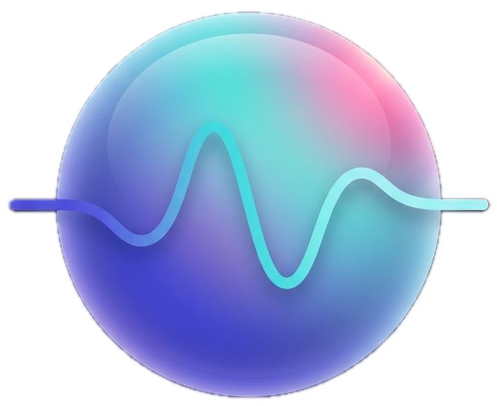

<p align="center">
  
</p>

<h1 align="center">Whisper Pilot</h1>

<p align="center">An invisible, realtime AI sidekick for conversations on macOS.</p>

Whisper Pilot listens to your meetings (Teams, Meet, Slack, Zoom, Discord, browser calls) and your microphone, transcribes the conversation in realtime, detects when someone asks **you** a question, and quietly streams a contextual answer into a translucent floating overlay. No prompts. No copy/paste. No "Ask AI" button.

> **Status:** early. The architecture is in place; the audio → transcription → trigger → AI streaming → overlay vertical slice is wired end-to-end. Many heuristics, models, and UI affordances are scaffolded for iteration. See `docs/ARCHITECTURE.md` and `docs/ROADMAP.md`.

## Why

Existing "AI assistants" force you to interrupt the flow of a conversation: switch windows, type a prompt, paste context. That defeats the point in a live call. Whisper Pilot is the opposite: ambient, proactive, and quiet by default. It only speaks up when a question on the call actually warrants help, and the answer is already streaming by the time you'd have alt-tabbed.

## Design philosophy

- **Realtime** — every layer is streaming. Audio → transcription → trigger → LLM → UI all pipe partial results.
- **Invisible** — translucent overlay, optional click-through, no chat UI.
- **Proactive** — the trigger engine decides when to ask the model, not the user.
- **Local-first by default** — system + microphone capture and transcription run on-device. Only the LLM call leaves your machine, and only with your own key.
- **Bring your own key** — no backend, no telemetry, no signup. You provide a Gemini API key (Anthropic Claude / OpenAI / local providers planned).
- **Free Apple stack** — no paid Developer Program needed. Builds and runs ad-hoc signed.

## Requirements

- macOS 14 (Sonoma) or later — ScreenCaptureKit audio capture requires 13+; we target 14 for SwiftUI ergonomics
- Apple Silicon recommended
- Xcode 15+
- [xcodegen](https://github.com/yonaskolb/XcodeGen) (`brew install xcodegen`)
- A Gemini API key from [aistudio.google.com](https://aistudio.google.com/app/apikey)

## Quick start

```bash
git clone git@github.com:vertocode/whisper-pilot.git
cd whisper-pilot
brew install xcodegen
xcodegen generate
open WhisperPilot.xcodeproj
```

Then in Xcode: select the **WhisperPilot** scheme and run (`⌘R`).

> A `Package.swift` is also committed for contributor convenience — `swift build` will type-check the whole module without Xcode. It does not produce a runnable `.app` (entitlements and `Info.plist` live in `Project.yml`).

On first launch:
1. Grant **Microphone** permission (optional — only if you want to capture your own voice)
2. Grant **Screen Recording** permission (required — this is how macOS exposes system audio via ScreenCaptureKit)
3. Open **Settings** (⌘,) and paste your Gemini API key. It's stored in the macOS Keychain, never on disk in plaintext.

Start a meeting in Teams / Meet / Slack / Zoom. Click the menu bar icon → **Start listening**. The overlay appears. When the other party asks you a question, an answer streams in.

## Architecture at a glance

```
                            ┌──────────────┐
   ScreenCaptureKit ──┐     │              │
                       ├──►  AudioMixer ──► VAD ──► Transcriber ──► TranscriptBuffer
   AVAudioEngine   ───┘     │              │                              │
   (microphone, opt)        └──────────────┘                              ▼
                                                                  ConversationContext
                                                                          │
                                                                          ▼
                                                                   TriggerEngine
                                                              (question? cooldown? VAD pause?)
                                                                          │
                                                                          ▼
                                                                    AIProvider
                                                                  (Gemini streaming)
                                                                          │
                                                                          ▼
                                                                   OverlayState ──► SwiftUI overlay
```

Module breakdown lives in [`docs/ARCHITECTURE.md`](docs/ARCHITECTURE.md).

## Configuration

Settings are persisted in `UserDefaults`; the API key is in Keychain.

| Setting | Default | Notes |
| --- | --- | --- |
| AI provider | `gemini` | `gemini` is the only one wired up; the protocol supports more |
| Gemini model | `gemini-2.0-flash` | low-latency tier |
| Response style | `concise` | `concise`, `detailed`, `strategic`, `follow-up` |
| Capture microphone | `false` | when off, only system audio is transcribed |
| Trigger cooldown | `8s` | minimum gap between proactive answers |
| VAD pause threshold | `700ms` | silence after a question that signals "your turn" |
| Always on top | `true` | NSWindow level `.floating` |
| Click-through | `false` | `ignoresMouseEvents` toggle |

## Privacy

- Audio is processed in-memory and never written to disk.
- Transcription runs locally via Apple's `SFSpeechRecognizer`. No audio leaves your machine for transcription.
- Only the prompt sent to your chosen LLM provider leaves your machine — and only when the trigger engine fires. No background polling.
- The Gemini API key lives in the macOS Keychain.
- There is no backend. There is no telemetry.

## Roadmap

See [`docs/ROADMAP.md`](docs/ROADMAP.md). Highlights:

- WhisperKit / whisper.cpp transcriber as a drop-in alternative to `SFSpeechRecognizer`
- Local LLM provider (Ollama, llama.cpp) behind the same `AIProvider` protocol
- Speaker diarization (so the assistant knows when **you** are the one asking vs. answering)
- Meeting summary + action item export at end of session
- Coding-interview mode (system design diagrams, step-through reasoning)
- Realtime translation overlay
- Personalized response style ("write like me")

## Contributing

See [`docs/CONTRIBUTING.md`](docs/CONTRIBUTING.md). The project is structured into small modules (audio, transcription, ai, triggers, context, overlay, settings, permissions). Every module is behind a protocol, so swapping in alternatives — different LLM, different transcriber, different VAD — is a matter of conforming to the protocol and registering the implementation in `AppCoordinator`.

## License

MIT — see [`LICENSE`](LICENSE).
