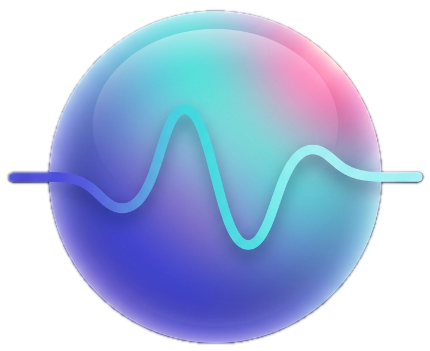

<p align="center">
  
</p>

<h1 align="center">Whisper Pilot</h1>

<p align="center">
  <strong>Ambient, local-first AI co-pilot for live conversations on your Mac.</strong><br>
  Listens, transcribes on-device, and lets you ask an AI about what's happening — without alt-tabbing.
</p>

<p align="center">
  <a href="https://github.com/vertocode/whisper-pilot/releases/latest"></a>
  <a href="https://github.com/vertocode/whisper-pilot/releases"></a>
  <a href="LICENSE"></a>
  <a href="#requirements"></a>
</p>

---

Whisper Pilot listens to anything your Mac can hear — meetings, podcasts, tutorials, your own voice — transcribes it on-device, and streams answers from your favorite LLM into a translucent floating overlay. Bring your own key. No backend. No telemetry. No signup.

**Built for:** live meetings (Zoom, Meet, Teams, Slack, Discord), tutorials and lectures, pair programming with screen context, live translation, and anything else you might want to ask a question *about right now*.

## Install

> **Alpha note:** releases are not yet signed with an Apple Developer ID, so macOS Gatekeeper will block the first launch. See [Allow the app through Gatekeeper](#allow-the-app-through-gatekeeper) below for the one-time unblock — it takes about ten seconds. Prefer to build from source? See [`docs/CONTRIBUTING.md`](docs/CONTRIBUTING.md#project-setup).

### Homebrew

```sh
brew install --cask vertocode/whisper-pilot/whisper-pilot
```

Update with `brew upgrade --cask whisper-pilot`. Uninstall with `brew uninstall --cask whisper-pilot`. Pass `--zap` to also clear preferences (session transcripts are deliberately kept).

### Direct download

Grab the latest `.dmg` from the [Releases page](https://github.com/vertocode/whisper-pilot/releases) and drag `WhisperPilot.app` into `/Applications`.

### Allow the app through Gatekeeper

Because Whisper Pilot isn't signed with an Apple Developer ID yet, the first launch (whether installed via Homebrew or the `.dmg`) shows a dialog like *"WhisperPilot can't be opened because Apple cannot check it for malicious software."* This is expected.

To allow it:

1. Open **System Settings → Privacy & Security**.
2. Scroll down to the **Security** section — you'll see a line that says *"WhisperPilot was blocked to protect your Mac."*
3. Click **Open Anyway** next to that line. macOS asks you to confirm with your password / Touch ID.
4. Launch Whisper Pilot again. This time a smaller dialog appears with an **Open** button — click it once. From then on, the app launches normally with no prompts.

If you prefer the Terminal: `xattr -dr com.apple.quarantine /Applications/WhisperPilot.app` removes the quarantine attribute and skips the dialog entirely.

### First run

1. Launch — the Sessions window opens. Click **Start new** to enter the overlay.
2. Open Settings from the overlay's `…` menu → **AI Provider** tab → paste your [Gemini API key](https://aistudio.google.com/app/apikey). Stored in Keychain.
3. Click **▶** in the overlay. macOS will prompt for **Microphone** permission (so your own voice can be transcribed) and, on Macs where the Core Audio Process Tap can't capture system audio, **Screen Recording** as well (used only for the system-audio capture path — no video is recorded). Grant whichever it asks for.

### Permissions reset every release — why?

macOS's privacy system (TCC) binds permission grants like Microphone and Screen Recording to the **code signature** of the binary that asked for them, not just the bundle ID. Whisper Pilot is currently distributed **unsigned** (no Apple Developer ID), so every release produces a different code-signing identity (none, really) — macOS sees each new build as a different app and asks for permission again.

There's no script-level workaround: macOS deliberately doesn't let installers or `sudo` grant TCC permissions on the user's behalf. The fix is to sign the app with a stable Apple Developer ID, after which TCC keeps the grant across rebuilds. `bin/release` already supports this when `WP_DEVELOPER_ID` is set in the environment — adopting it just requires an [Apple Developer Program](https://developer.apple.com/programs/) membership ($99/year).

If your Mac can't see system audio (typical on some Mac mini / USB / Bluetooth output configurations where the default Core Audio Process Tap silently delivers no frames), Whisper Pilot now detects it during the session and switches to the ScreenCaptureKit capture path automatically — silently when Screen Recording permission is already granted, or via a one-click prompt in the transcript pane otherwise. The choice is remembered for future sessions.

### Where to find logs after a crash

If Whisper Pilot vanishes without warning ("the app closed by itself"), it's almost always because of a hard crash. Because the app runs as an accessory (no Dock icon), macOS doesn't always show a dialog. Two places to look:

- **`~/Library/Application Support/com.whisperpilot.app/runtime.log`** — Whisper Pilot's own rolling log, written line-by-line. The tail is what was happening immediately before the crash. The app surfaces the last ~20 lines automatically on the next launch via the in-app log pane.
- **`~/Library/Logs/DiagnosticReports/WhisperPilot-*.crash` (or `.ips`)** — macOS's own crash report with a full stack trace. Open in Console.app (Action → Reveal in Finder works backwards too).

Please attach both when [reporting a bug](https://github.com/vertocode/whisper-pilot/issues) about unexpected closes.

### Report a bug

Hit a problem during install or use? Please [open an issue](https://github.com/vertocode/whisper-pilot/issues) — include your macOS version, what you ran, and any messages from the overlay's log panel. Pull requests with a fix are even better.

## Requirements

- macOS 14 (Sonoma) or later
- Apple Silicon recommended (Intel works; transcription is slower)
- A Gemini API key from [aistudio.google.com](https://aistudio.google.com/app/apikey)

## How you use it

The overlay is always available once you've picked a session.

- **Detected questions.** When someone asks *you* a question in a meeting, the trigger engine notices and streams a suggested answer into the AI lane automatically.
- **Composer.** Type any question in the box at the bottom. ⌘⏎ to send. Tick *See my screen* to also include a screenshot.
- **Auto-send.** Optionally set an interval (30s–5m) and the assistant proactively summarizes the recent conversation on every tick. Off by default.
- **Pause AI.** Sparkles button in the header. Listening + transcribing keep running; only the AI is silenced.

## Privacy

- **Audio never leaves your device.** Capture and transcription are entirely local — `SFSpeechRecognizer` with on-device recognition where the locale supports it.
- **The LLM is the only thing that talks to the network**, and only when *you* trigger it (auto-send tick, detected question, or composer submit). No background polling.
- **Your API key lives in the macOS Keychain.** Never written to disk in plaintext.
- **Screenshots are sent only when you tick *See my screen*** — never cached, never persisted.

## Documentation

| | |
| --- | --- |
| [`docs/ARCHITECTURE.md`](docs/ARCHITECTURE.md) | Module-by-module breakdown, data flow, protocols |
| [`docs/CONFIGURATION.md`](docs/CONFIGURATION.md) | Every setting and what it controls |
| [`docs/SESSIONS.md`](docs/SESSIONS.md) | On-disk session format and resume semantics |
| [`docs/CONTRIBUTING.md`](docs/CONTRIBUTING.md) | Build from source, conventions, areas that need help |
| [`docs/RELEASE.md`](docs/RELEASE.md) | DMG signing, notarization, Homebrew tap workflow |
| [`docs/ROADMAP.md`](docs/ROADMAP.md) | What's next: WhisperKit, Ollama, diarization, modes, RAG |

## Contributing

The codebase is small, protocol-first, and intentionally non-magical — most contributions fit inside a single module. Start with [`docs/ARCHITECTURE.md`](docs/ARCHITECTURE.md), then [`docs/CONTRIBUTING.md`](docs/CONTRIBUTING.md). High-value areas right now: WhisperKit transcriber, Ollama provider, snapshot tests for the trigger heuristics, real app icon.

## License

MIT — see [`LICENSE`](LICENSE).
